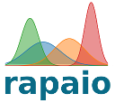

<table style="border: 0">
<tr><td>

</td>
<td>

### Disambiguation

1. (Italian dictionary) *Field of turnips. It is also a place 
where there is confusion, where tricks and sims are plotted.*

2. (Computer science) *Statistics, data mining and machine learning 
library written in Java.*

</td>
</tr>
</table>

<table style="border: 0">
<tr><td>

###### Try it online:
 
 

</td>
<td>

###### Build status:

</td>
</tr>
</table>

### What gap *rapaio* tries to fill?

There are a lot of software stacks out there which provides plenty of 
nicely crafted tools for statistics, machine learning, data mining or 
pattern recognition. Many of them are available as open source, 
quality is high and they are full of reach features.

It appears like a legitimate question to ask *"Why another library for 
statistics and machine learning?"*. Socrates said that *"understanding 
a question is half of an answer"*. In our case the question would be 
complete if we append it with context *"Why another library for statistics 
and machine learning, when there are many available already?"*. 
My answer is: because none of them covers the taste and needs of everybody.

Some reasons which provide motivation for this library are:

* *I like R*. I like functional paradigms, but the R 
language, like it is now, it's not something which I really want to 
program in for a long time. Take for example the error handling.

* *I like Python* for its simplicity and elegance. Python is really good 
as glue language. This comes to a price: a plethora of things required. 
But more than that, I really hate that displaying a graph 
in a window of a given size can be done in too many ways, 
many of them undocumented and hackish. I prefer to memorize ideas 
rather than syntax.

* *I like Weka* for its plenty of implementations. But I really do not like 
the standard Java OOP way of doing things. There are no short methods.
And the GUI mode. I am a programmer. I want to have the freedom given
by a programming language, like Java is.

In the end, I would really love to have an environment, a box full with 
plenty of tools, which can be extended, which allows me to experiment, 
study and learn. And I want to do all those things in an interactive way, 
where I would program my ideas. Java community deserves such kind of tool 
and this library aims to fill the gap.

### Documentation

**Rapaio Manual** is now published in this repository in the form of IPython notebooks format. Please inspect the notebooks folder 
of this repository.

The manual contains a [Tutorial on Kaggle's Titanic Competition](https://aureliantutuianu.gitbooks.io/rapaio-manual/content/kaggle-titanic.html)!

### Acknowledgements

Many thanks to JetBrains for providing an open source license for their [Java IDE](https://www.jetbrains.com/idea/).

