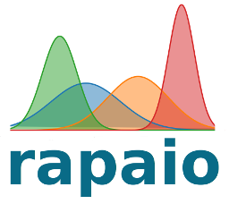

<table style="border: none">
<tr><td>

</td>
<td>

## Disambiguation

1.  (Italian dictionary) *Field of turnips. It is also a place 
where there is confusion, where tricks and sims are plotted.*

2.  (Computer science) *Statistics, data mining and machine learning 
library written in Java.*
</td>
</tr>
</table>
<table style="border: none">
<tr><td>

### Try it online
 
 

</td>
<td>

### Build status

</td>
</tr>
</table>

## Documentation

[Rapaio](https://padreati.github.io/rapaio/) is a rich collection of data mining, statistics and machine learning tools
written completely in Java. Documentation for this library is hosted as [github pages](https://padreati.github.io/rapaio/).
Most of the documentation is written as Jupyter notebooks and hosted at 
[rapaio-notebooks github repository](https://github.com/padreati/rapaio-notebooks). The notebooks repository can also be 
spinned up through [binder]().

## Installation

Last published release on maven central is 2.4.0

       <dependency>
         <groupId>io.github.padreati</groupId>
         <artifactId>rapaio</artifactId>
         <version>2.4.0</version>
       </dependency>

The best way for exploration is through jupyter / jupyter-lab notebooks. 
This is excellent for experimenting with interactive notebooks or 
to document the ideas you are working on. 

You have to install jupyter / jupyter-lab and IJava kernel. For more information
you can follow the instruction from 
[IJava](https://github.com/SpencerPark/IJava#installing). The following 
notation is specific to IJava kernel jupyter notation. 

    %maven io.github.padreati:rapaio:2.4.0  

## Acknowledgements

Many thanks to 
 
who provided open source licenses for their brilliant IDE 

 
Many thanks to [SpencerPark](https://github.com/SpencerPark) for the java kernel he realized 
[IJava jupyter kernel](https://github.com/SpencerPark/IJava).

